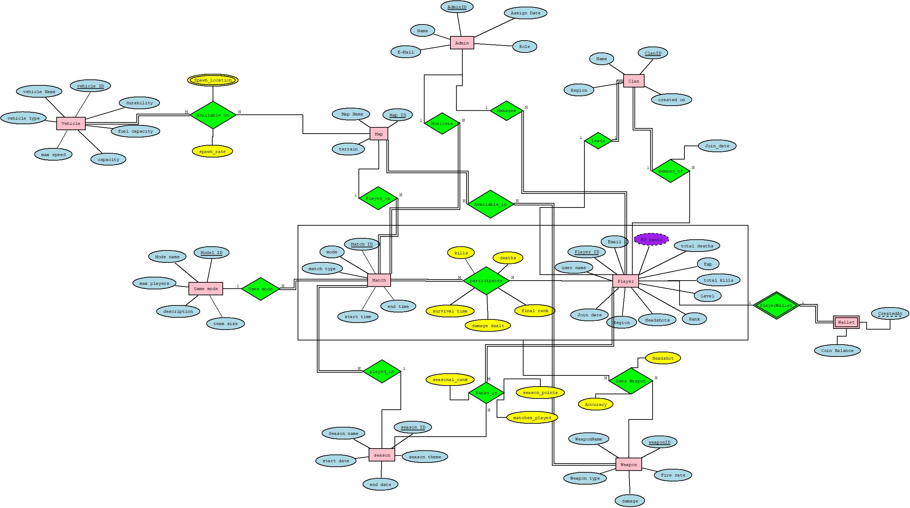

# 🎮 Game Database Dashboard

A comprehensive relational database project built using PostgreSQL to model and analyze a multiplayer gaming ecosystem. The database is designed to efficiently manage interconnected game entities while supporting advanced analytical queries through stored functions and procedures.

---

## 📖 Overview

This project demonstrates the design and implementation of a normalized relational database for a multiplayer game. It models core entities such as players, clans, matches, weapons, maps, seasons, and administrators, enabling efficient data management and meaningful game analytics.

The project emphasizes database design principles, relational modeling, and SQL-based data analysis.

---

## ✨ Features

- 🏆 Player leaderboard and rankings
- 🎯 Favorite weapon analysis
- 🎮 Player match history
- 👥 Clan information and statistics
- 🔫 Weapon performance leaderboard
- ⚔️ Player comparison
- 📊 Match summary generation
- 📅 Season-wise analytics
- 👨‍💼 Administrator-based player management
- 🗺️ Map statistics and insights

---

## 🛠 Technologies Used

- PostgreSQL
- SQL
- Relational Database Design
- Entity Relationship Modeling (ERD)
- Database Normalization
- Stored Functions
- Stored Procedures

---

## 📂 Project Structure

```
Game-Database-Dashboard/
│── DDL.sql
│── InsertOperations.sql
│── Queries.sql
│── ERD.jpeg
│── ERD and Relational Schema.pdf
│── README.md
```

---

## 🗂️ Entity Relationship Diagram

The following ER diagram represents the database schema and relationships among the entities.



---

## 📁 Project Files

| File | Description |
|------|-------------|
| **DDL.sql** | SQL script for creating the database schema |
| **InsertOperations.sql** | Sample data insertion scripts |
| **Queries.sql** | SQL queries, stored functions, and procedures |
| **ERD.jpeg** | Visual representation of the database schema |
| **ERD and Relational Schema.pdf** | Complete ER diagram and normalized relational schema |

---

## 🎯 Functionalities

The database supports:

- Player performance analysis
- Match history retrieval
- Weapon usage statistics
- Clan management
- Season summaries
- Map-based analytics
- Administrative reports
- Leaderboard generation

---

## 📚 Concepts Demonstrated

- Relational Database Design
- Entity Relationship Modeling
- Database Normalization
- SQL Query Writing
- Aggregate Functions
- Joins
- Stored Functions
- Stored Procedures
- Data Integrity

---

## 🚀 Future Enhancements

- Interactive dashboard for database visualization
- Additional analytical reports
- Performance optimization for large datasets
- Advanced indexing strategies
- Role-based database access control

---

## 👨‍💻 Author

**Dhvanit Shah**

---
⭐ If you found this project interesting, feel free to explore the SQL scripts and database design.
